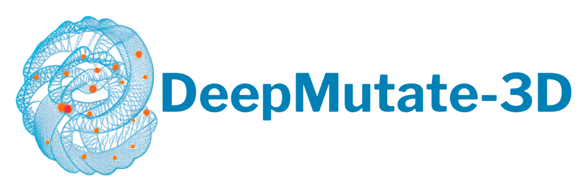

<h1 align="center">
  
</h1>

<p align="center">
  Predict the effect of every possible point mutation in a protein
  and see the result on its 3D structure.
</p>

DeepMutate-3D scores all 19 possible substitutions at every residue with the
ESM-2 protein language model, then paints the per-residue sensitivity onto the
AlphaFold predicted fold. Red marks positions where mutation is likely to be
damaging. Blue marks positions that tolerate change.

<p align="center">
  <a href="LICENSE"></a>
  <a href="https://www.python.org/"></a>
  <a href="https://huggingface.co/spaces/ras1992/DeepMutate-3D"></a>
</p>

## Contents

- [Install](#install)
- [Quick start](#quick-start)
- [Usage](#usage)
- [How it works](#how-it-works)
- [Benchmarks](#benchmarks)
- [Examples](#examples)
- [Citation](#citation)
- [License](#license)

## Install

```bash
git clone https://github.com/Saadman/DeepMutate-3D.git
cd DeepMutate-3D
python3 -m venv .venv && source .venv/bin/activate
pip install -r requirements.txt
```

Runs on NVIDIA (`cuda`), Apple Silicon (`mps`) or CPU. The device is selected
automatically. The first run downloads the model weights and caches them.

## Quick start

```bash
python app.py
```

Open http://127.0.0.1:7860, enter a UniProt ID such as `P69905`, leave the
sequence box empty, and press scan.

## Usage

**Inputs.** A protein sequence (raw or FASTA) and a UniProt accession. If the
sequence box is empty, the canonical sequence is fetched from UniProt, which
also guarantees the scores line up with the structure.

**Options.**

| Option | Choices | Notes |
| --- | --- | --- |
| Model | ESM-2 35M, 150M, 650M | 650M is the default and the most accurate |
| Scoring mode | masked marginals, wildtype marginals | wildtype is far faster and nearly as accurate |

**Outputs.**

- An interactive 3D structure coloured by mutation sensitivity. Hover any point
  on the ribbon to read that residue's scores.
- A per-residue table: sensitivity score, verdict, most damaging substitution
  and most tolerated substitution.
- Two downloads: the table as CSV, and the structure as a PDB file whose
  B-factor column carries the sensitivity score, so it opens in PyMOL or
  ChimeraX and colours with `spectrum b, red_white_blue`.

Proteins longer than the 1022 residue ESM-2 context are covered with
overlapping windows, so length is not a limit.

## How it works

For every position `i` and every substitution `m`, the model computes a
log-likelihood ratio against the wildtype residue:

```
LLR(i, m) = log P(m | context) - log P(wildtype_i | context)
```

The 19 non-wildtype LLRs at each position are averaged into a single Residue
Sensitivity Score. Scores are written into the PDB B-factor column and rendered
with py3Dmol using a red-white-blue gradient centred on zero.

Nothing is trained or fine-tuned here. Predictions are zero-shot.

## Benchmarks

Zero-shot, no experimental data shown to the model.

| Benchmark | Scale | Result |
| --- | --- | --- |
| [ProteinGym](https://proteingym.org) | 197 DMS assays, 644,231 variants | Spearman rho 0.431 |
| ClinVar | 2,011 proteins, 38,901 variants | AUROC 0.881 |

Full tables, the model size ablation, and the runtime comparison across CPU,
Apple Silicon and NVIDIA are in [docs/BENCHMARKS.md](docs/BENCHMARKS.md).

Reproduce:

```bash
pip install -r validation/requirements.txt
mkdir -p validation/data
curl -L -o validation/data/DMS_substitutions.parquet \
  https://proteingym.s3.amazonaws.com/DMS_substitutions.parquet
python validation/run_proteingym.py --mode wt
```

## Examples

Worked case studies with reproducible output are in
[docs/USE_CASES.md](docs/USE_CASES.md), covering cancer hotspot recovery in
TP53, catalytic site recovery across an enzyme panel, and selecting tolerant
positions for library design.

```bash
python examples/use_cases.py
```

## Citation

If you use DeepMutate-3D, please cite it (see [CITATION.cff](CITATION.cff)) and
the underlying resources. AlphaFold data is CC-BY-4.0 and requires attribution.

- Lin, Z. et al. Evolutionary-scale prediction of atomic-level protein structure with a language model. Science 379, 1123-1130 (2023).
- Meier, J. et al. Language models enable zero-shot prediction of the effects of mutations on protein function. NeurIPS (2021).
- Jumper, J. et al. Highly accurate protein structure prediction with AlphaFold. Nature 596, 583-589 (2021).
- Varadi, M. et al. AlphaFold Protein Structure Database in 2024. Nucleic Acids Research 52, D368-D375 (2024).

## License

[Apache-2.0](LICENSE). Free for academic and commercial use.

DeepMutate-3D retrieves but does not redistribute ESM-2 (MIT), AlphaFold DB
structures (CC-BY-4.0) and UniProt sequences (CC-BY-4.0). Full attributions in
[NOTICE](NOTICE).

## Disclaimer

DeepMutate-3D predicts evolutionary constraint, which correlates with but is not
identical to pathogenicity. It is a research tool for hypothesis generation and
must not be used to inform clinical or diagnostic decisions.
